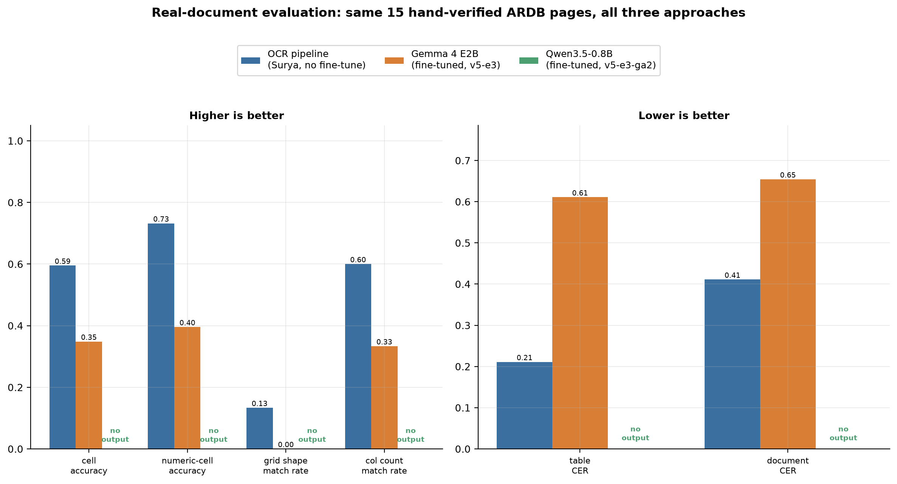
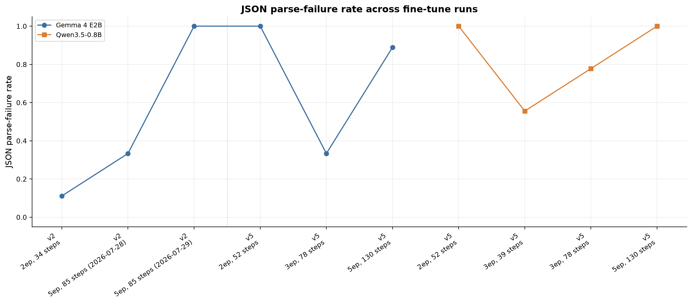
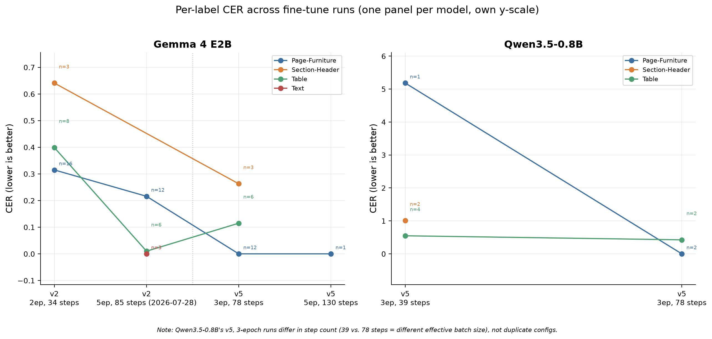
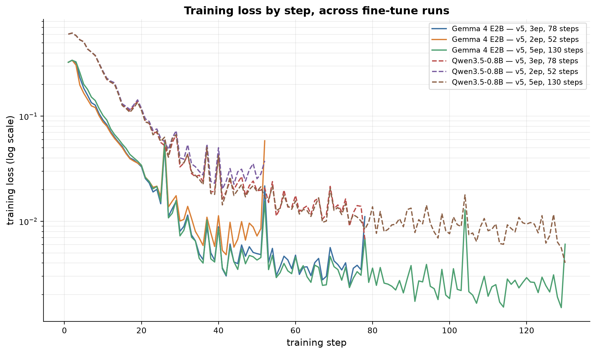

# Fine-tune evaluation figures

Four charts from the Gemma 4 E2B / Qwen3.5-0.8B ARDB fine-tuning work: the epoch sweep for
each model (2, 3, and 5 epochs on the `Soxavin/ardb-sft-v5` dataset) and how the best config
from each compares against the existing production OCR pipeline on real documents. Full
numbers and narrative live in `eval/gemma_finetune_runs.md`, `eval/qwen_finetune_runs.md`,
and their `.csv` companions — these charts are the visual summary, not a replacement for
those logs.

(The other four images in this folder — `accuracy_by_font.png`, `cer_by_dataset.png`,
`engine_comparison.png`, `table_fragmentation.png` — are from earlier, separate OCR-engine
benchmarking work and aren't covered by this README.)

---

## 1. `real_doc_comparison.png` — does either fine-tune actually work?



**What it shows**: the existing OCR pipeline (Surya, no fine-tuning) vs. each model's
best-performing fine-tuned adapter, scored on the *same* 15 real, hand-verified ARDB pages —
documents neither model trained on. Left panel is metrics where a higher bar is better
(accuracy and match-rate); right panel is metrics where a lower bar is better (character
error rate). Qwen shows no bars at all — every one of its 15 pages failed to produce usable
output, so there's nothing to score, marked "no output" rather than a misleading zero.

**How to read it**: compare bar heights within each metric group. The OCR pipeline (blue) is
taller than Gemma (orange) on every "higher is better" metric and shorter on every "lower is
better" metric — meaning it wins on every axis measured.

**Takeaway**: this is the headline result. On real documents, the production OCR pipeline
currently outperforms both fine-tuned models, and Qwen doesn't produce usable structured
output at all. Gemma comes closer but isn't yet competitive with the existing pipeline.

---

## 2. `parse_failure_rate_by_run.png` — can the model produce valid output at all?



**What it shows**: for every training run in the epoch sweep, what fraction of validation
pages the model failed to even produce syntactically valid JSON for (1.0 = every page
failed, 0.0 = every page parsed). This is the most basic pass/fail signal — before asking
"is the text accurate," this asks "did the model produce a readable answer at all."

**How to read it**: each point is one training run, labeled with its dataset version, epoch
count, and step count (step count matters because two runs can share the same epoch count
but a different effective batch size — see the note under chart 3 below for a concrete
example). The dotted vertical line separates the two dataset versions used across this
project (`v2`, an earlier/smaller dataset, and `v5`, the current one) — they aren't directly
comparable points on one continuous sweep.

**Takeaway**: for both models, 3 epochs is the best-performing point in the sweep — both
fewer (2) and more (5) epochs produced *more* failures, not fewer. That's the same pattern
in both models independently, which is why we didn't chase higher epoch counts further.

---

## 3. `cer_by_run.png` — when it *does* parse, how accurate is the text?



**What it shows**: Character Error Rate (CER) — roughly, "what fraction of characters would
need to change to turn the model's output into the correct answer," so lower is better —
broken out by content type (table text, section headers, page letterhead, etc.), for every
run and every model. Gemma and Qwen get their own panel with their own y-axis scale, because
one Qwen data point (a Section-Header CER over 5) would otherwise squash every other,
more relevant point into an unreadable cluster near zero.

**How to read it**: each small number next to a point (e.g. `n=6`) is how many pages that
point's average is actually based on. **This matters** — a point based on `n=1` is a single
data point, not a trend, and shouldn't be read with the same confidence as one based on
`n=12`. The italic note at the bottom flags a specific case worth knowing about: Qwen's two
"3 epoch" points aren't duplicates — they used a different gradient-accumulation setting
(different effective batch size), which is why they have different step counts despite the
same epoch count.

**Takeaway**: CER trends broadly track the parse-failure chart, but sample sizes shrink a
lot at the worse-performing runs (fewer pages parse → fewer pages to average), so the
higher-epoch points' CER numbers are on thinner evidence than the 3-epoch points'.

---

## 4. `loss_by_run.png` — did training itself work?



**What it shows**: the model's training loss at every step, for every run, on a log scale.
This is a training-process sanity check, not a quality result — it answers "did the
optimizer converge normally," not "is the model good."

**How to read it**: a clean, steadily-dropping line means training ran without errors and
the model fit its training data. It does **not** mean the model generalizes well — one of
the cleanest-looking curves in this project's history (an earlier Gemma run, not shown on
this specific chart) still produced 9 failures out of 9 validation pages. Use this chart
alongside charts 2 and 3, never instead of them.

**Takeaway**: every run's loss dropped cleanly and as expected — training itself was never
the problem in any of these runs. Whatever is limiting output quality (see charts 1-3) is a
generalization/reliability issue, not a training-failure issue.

---

## Regenerating these figures

```bash
uv run python3 scripts/plot_run_metrics.py eval/gemma_finetune_runs.csv eval/qwen_finetune_runs.csv --out-dir docs/figures
uv run python3 scripts/plot_real_doc_comparison.py eval/real_doc_eval.csv --out docs/figures/real_doc_comparison.png
```

Both scripts read directly from the `eval/*.csv` run logs, so figures always reflect
whatever is currently logged there — re-run them after logging any new fine-tune result.
