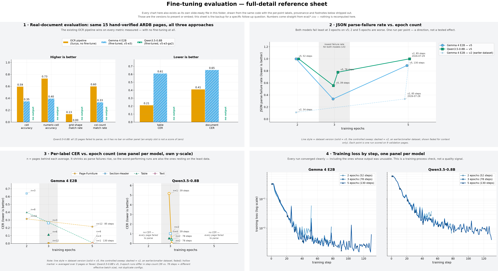
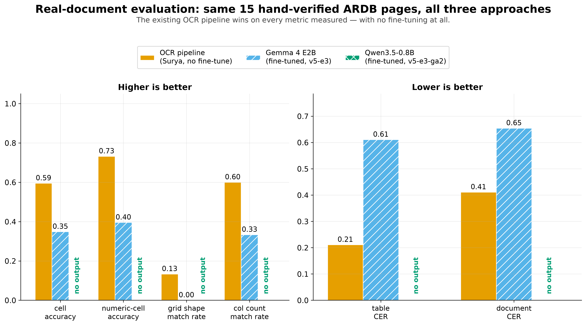
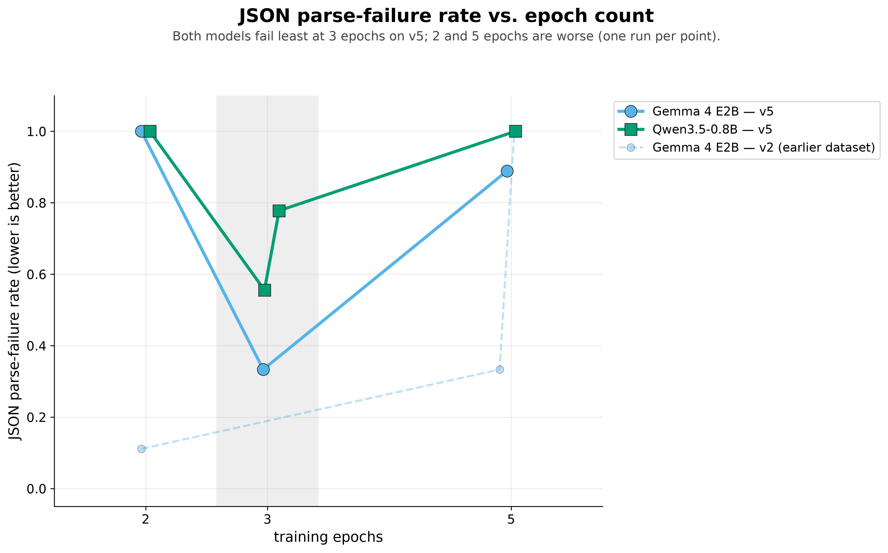
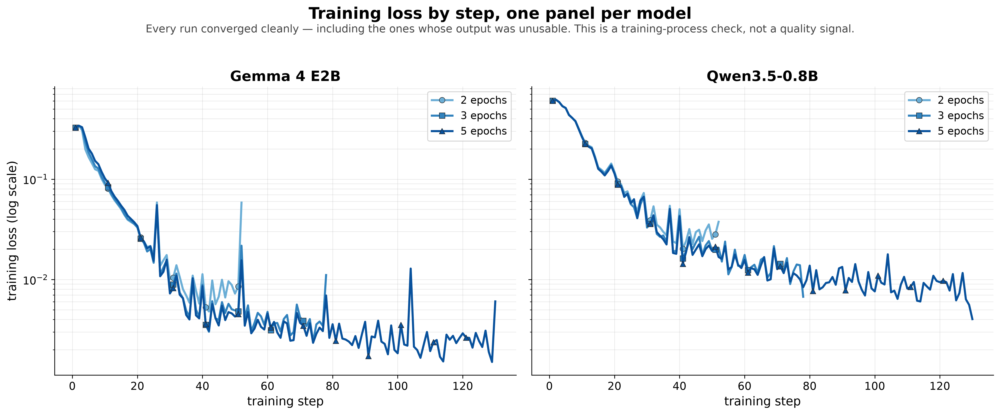

# Fine-tune evaluation figures

Five charts (plus one full-detail reference sheet, described below) from the Gemma 4 E2B /
Qwen3.5-0.8B ARDB fine-tuning work: an overview of the whole
experiment, the epoch sweep for each model (2, 3, and 5 epochs on the `Soxavin/ardb-sft-v5`
dataset), and how the best config from each compares against the existing production OCR
pipeline on real documents. Full numbers and narrative live in `eval/gemma_finetune_runs.md`,
`eval/qwen_finetune_runs.md`, and their `.csv` companions — these charts are the visual summary,
not a replacement for those logs.

**The story across all five, in one paragraph**: the existing production OCR pipeline needed
no fine-tuning at all to outperform both models on real documents (charts 0 and 1) — that's the
headline. Both models struggle to produce even syntactically valid output on a meaningful
share of pages (chart 2), and that struggle doesn't resolve by training longer: for both
models independently, 3 epochs is the best point in the sweep, with both fewer and more
epochs making things worse (charts 2 and 3). Training itself was never the problem — every
run converged cleanly (chart 4) — so the open trade-off is generalization/output-reliability
at this data scale, not an optimizer or training-setup issue.

**These figures are built for two audiences at once.** A report reader has surrounding prose,
time, and this README; a presentation viewer has a projector, no prose, and about forty seconds.
Sizing for the harder case — larger type throughout, the key finding marked on the chart itself,
a factual one-line subtitle under every title — also improves the report render, since a report
embeds these PNGs scaled *down* to column width. There is deliberately no separate "slide" and
"report" export of any chart: the only difference would have been a scale factor, at the cost of
doubling every artifact and every explanation below. (The lean/detail split described next is a
different axis — how much *text* a figure carries, not how big it is — and it produces one extra
image in total, not a second copy of each.)

---

## Two tiers: five lean charts, one detail sheet

The five numbered files below are **lean**. They carry a title, a one-line finding, axis labels,
a legend and the data — and not much else. Anything a viewer would have to *read* rather than
*see* has been pulled off them: per-point sample sizes (`n=`), per-run step counts and dates,
and the italic footnotes explaining conventions. Those charts had reached the point where the
text was doing work the shape of the data already does, and on a slide the text wins the
attention while the finding loses it.

That detail wasn't thrown away. It all lives on one extra image:

### `finetune_dashboard.png` — the full-detail reference sheet



A 2×2 sheet holding the fully-annotated version of charts 1–4 (the overview chart, 0, is
already minimal and isn't repeated). Every `n=`, step count, date and footnote the lean charts
drop is on it. It is **not** a presentation asset — it's read on screen at reference scale, so
it's much denser and its type is sized for a laptop, not a projector. Open it when a specific
follow-up question gets asked ("how many pages was that average over?", "which of the two
3-epoch runs is that point?").

Both tiers come out of the same drawing code: each chart's `compose_*()` function takes a
`detail` flag, the standalone file calls it one way and the dashboard the other. A lean chart
and its dashboard block therefore cannot drift out of sync, because they are not two charts.

(The four images one level up in `docs/figures/` — `accuracy_by_font.png`, `cer_by_dataset.png`,
`engine_comparison.png`, `table_fragmentation.png` — are from earlier, separate OCR-engine
benchmarking work and aren't covered by this README; these fine-tune-eval figures live in their
own `finetune_eval/` subfolder to keep the two sets of charts from mixing together.)

---

## 0. `finetune_story_overview.png` — the whole experiment on one slide


**What it shows**: the two questions of this experiment, in the order they were asked. Left
panel: as epoch count goes up, what share of validation pages produce output that can't be
parsed at all? Right panel: taking the best-performing adapter from each of those sweeps, how
does it score against the existing OCR pipeline on 15 real, held-out pages — on the single most
citable metric, table CER?

**How to read it**: left to right is the argument. Both lines dip at 3 epochs (the shaded band)
and rise again at 5; the right panel then shows that the winner of that sweep still lost. Color
is model, consistent with every other chart here (orange = the existing OCR pipeline, blue =
Gemma, green = Qwen); the bars also carry a hatch pattern so the three approaches stay
distinguishable in grayscale, where orange and blue desaturate to nearly the same tone.

**Takeaway**: intended as the opening slide of the sequence, so the four detail charts below can
be read as evidence for a claim the viewer has already seen rather than as five separate results.

**It is deliberately lossy — prefer the detail charts when citing anything.** The left panel
plots only the `v5` sweep (the controlled one) and drops the per-run step-count provenance;
where a model has two runs at the same epoch count, it plots the one whose effective batch size
matches the sweep's constant (Qwen's 78-step 3-epoch run, the same adapter the right panel
scores), rather than averaging them into a number that appears in no run log. The right panel
plots one metric where `real_doc_comparison.png` plots six. Every number here also appears on a
detail chart; if the two ever disagree, the detail chart is right.

---

## 1. `real_doc_comparison.png` — does either fine-tune actually work?



**What it shows**: the existing OCR pipeline (Surya, no fine-tuning) vs. each model's
best-performing fine-tuned adapter, scored on the *same* 15 real, hand-verified ARDB pages —
documents neither model trained on. Left panel is metrics where a higher bar is better
(accuracy and match-rate); right panel is metrics where a lower bar is better (character
error rate). Qwen shows no bars at all — every one of its 15 pages failed to produce usable
output, so there's nothing to score, marked "no output" rather than a misleading zero.

**How to read it**: compare bar heights within each metric group (see the legend for which
color and hatch is which approach). The OCR pipeline is taller than Gemma on every "higher is
better" metric and shorter on every "lower is better" metric — meaning it wins on every axis
measured. Two things that look similar are not: a labelled `0.00` (Gemma's grid-shape match
rate) is a real, measured score of zero, whereas an empty slot marked "no output" means nothing
was produced to score. On a CER axis those are opposites — a true 0.00 would be a *perfect*
transcription.

**Takeaway**: this is the headline result. On real documents, the production OCR pipeline
currently outperforms both fine-tuned models, and Qwen doesn't produce usable structured
output at all. Gemma comes closer but isn't yet competitive with the existing pipeline.

---

## 2. `parse_failure_rate_by_run.png` — can the model produce valid output at all?



**What it shows**: for every training run in the epoch sweep, what fraction of validation
pages the model failed to even produce syntactically valid JSON for (1.0 = every page
failed, 0.0 = every page parsed). This is the most basic pass/fail signal — before asking
"is the text accurate," this asks "did the model produce a readable answer at all."

**How to read it**: the x-axis is **epoch count itself** (2, 3, 5) — not run order — so both
models' points at the same epoch count line up vertically and can be compared directly. Color
is model (blue = Gemma, green = Qwen, matching charts 0 and 1). The shaded band marks 3 epochs,
where both models' `v5` lines bottom out; it's a pointer at a value on the x-axis, not a
confidence interval, and every point behind it is still a single run.

**Line style is dataset version, and the two are not peers.** Solid = `v5`, the controlled
sweep this chart is about. Dashed and faded = `v2`, an earlier and smaller dataset whose ground
truth was still being corrected partway through (see `eval/gemma_finetune_runs.md`). The `v2`
line is kept for completeness but drawn recessively on purpose: its 2-epoch point is the lowest
failure rate anywhere on the chart, and at equal visual weight it reads as part of the sweep and
suggests the opposite conclusion — while actually measuring a different dataset under different
ground truth. Qwen has only `v5` data, so its line is always solid.

**Which run is which point** is not on this file. Where two runs of the same model share an
epoch count they differ in dataset version, in step count (i.e. effective batch size), or — for
one identical-config repeat — only in date. That provenance is labelled per point on
`finetune_dashboard.png`, and written out in `eval/*_finetune_runs.md`. The 3-epoch band is
left uncaptioned here for the same reason: the subtitle already names the finding, so a caption
would be the third statement of it on one image.

**Takeaway**: for both models, 3 epochs is the best-performing point in the sweep — both
fewer (2) and more (5) epochs produced *more* failures, not fewer, and with epoch count on
the x-axis that V-shape is visible in both lines at a glance. That's the same pattern in both
models independently, which is why we didn't chase higher epoch counts further.

---

## 3. `cer_by_run.png` — when it *does* parse, how accurate is the text?


**What it shows**: Character Error Rate (CER) — roughly, "what fraction of characters would
need to change to turn the model's output into the correct answer," so lower is better —
broken out by content type (table text, section headers, page letterhead, etc.), for every
run and every model. Gemma and Qwen get their own panel with their own y-axis scale, because
one Qwen data point (a Page-Furniture CER over 5) would otherwise squash every other,
more relevant point into an unreadable cluster near zero.

**How to read it**: x-axis is epoch count, same convention and same 3-epoch band as chart 2.
Color is content label (see the shared legend at top); line style is dataset version (solid
`v5`, dashed `v2` — same meaning as chart 2).

**One thing is marked that a plain line chart would hide**: an epoch column with no line at all
is labelled **"no CER — every page failed to parse."** Qwen's 2- and 5-epoch runs were both run
and both produced nothing scorable; an empty column with no note would read as "we didn't try
that," when in fact the emptiness *is* the finding. That stays on the lean chart because it
prevents a misreading, not because it adds detail.

**Sample sizes are not on this file — read them off the dashboard before citing any point.**
Each point is an average over however many pages parsed on that run, which ranges from 12 down
to 1. A point based on one document is not a trend, and it looks exactly like a point based on
twelve here. `finetune_dashboard.png` labels every point with its `n=` and draws any point
resting on 3 pages or fewer hollow; it also carries the footnote about Qwen's two "3 epoch"
points not being duplicates (they used a different gradient-accumulation setting, hence
different step counts at the same epoch count). Those were on this chart until the per-point
labels became the loudest thing on it — a caveat nobody reads because the chart is too busy is
worth less than a clean chart plus a sheet that states it.

**Takeaway**: CER trends broadly track the parse-failure chart, but sample sizes shrink a
lot at the worse-performing runs (fewer pages parse → fewer pages to average), so the
higher-epoch points' CER numbers are on thinner evidence than the 3-epoch points'.

---

## 4. `loss_by_run.png` — did training itself work?



**What it shows**: the model's training loss at every step, for every run, on a log scale,
split into one panel per model (Gemma left, Qwen right) so each panel only has to hold that
model's own runs rather than all six overlaid on one axis.

**How to read it**: this is a training-process sanity check, not a quality result — it
answers "did the optimizer converge normally," not "is the model good." A clean, steadily-
dropping line means training ran without errors and the model fit its training data. It does
**not** mean the model generalizes well — one of the cleanest-looking curves in this
project's history (an earlier Gemma run, not shown on this specific chart) still produced 9
failures out of 9 validation pages. Use this chart alongside charts 2 and 3, never instead of
them.

The legend names each run by its epoch count only. Step counts (which identify the exact run in
`eval/loss_history.csv`) are on the dashboard version of this panel.

Colour here means **epoch count**, not model (the model is the panel), and because epoch count
is an ordered quantity the three runs use one hue from light to dark — more epochs = darker —
rather than three unrelated colours. That ordering is readable without consulting the legend and
survives grayscale printing on its own; marker shape carries the same distinction redundantly.
Note this is a different colour scheme from charts 0–2, deliberately: reusing the model colours
here would have made "orange" mean an approach on one slide and an epoch count on the next.

**Takeaway**: every run's loss dropped cleanly and as expected — training itself was never
the problem in any of these runs. Whatever is limiting output quality (see charts 1-3) is a
generalization/reliability issue, not a training-failure issue.

---

## A few things worth knowing before citing these numbers

- **Every run is a single seed.** Nothing here is averaged over repeated runs with different
  random seeds (Colab GPU time was a real, repeatedly-managed cost constraint throughout this
  project), so there are no error bars or confidence intervals on any chart. Read point-to-point
  differences as directional trends confirmed across two independent model families (the
  dashboard sheet's `n=` labels say how much data backs any one point), not as statistically
  tested results.
  The 3-epoch highlight band on charts 0, 2 and 3 marks where the observed minimum falls; it
  carries no statistical claim beyond that.
- **Colors are chosen to be colorblind-safe** (the Okabe-Ito palette), and every series that
  needs to survive grayscale printing also varies by marker shape, linestyle, marker fill
  (hollow = thin sample, dashboard only), or hatch pattern — never by color alone. This is verified by actually
  converting each rendered PNG to grayscale and re-reading it, not assumed: that check is what
  caught the OCR-pipeline and Gemma *bars* desaturating to the same tone (now hatched), and what
  drove replacing Okabe-Ito's yellow — which fails a colorblind-palette lightness check outright
  and sits at 1.29:1 contrast against white — with its reddish purple for the "Text" series.

## File formats

Each chart is written as both a `.png` (raster, for pasting directly into a document) and a
`.pdf` (vector, for print or any context where the image gets resized — it won't pixelate).
Use whichever your report tool handles better; the content is identical either way.

## Regenerating these figures

```bash
uv run python3 scripts/plot_run_metrics.py eval/gemma_finetune_runs.csv eval/qwen_finetune_runs.csv --out-dir docs/figures/finetune_eval
uv run python3 scripts/plot_real_doc_comparison.py eval/real_doc_eval.csv --out docs/figures/finetune_eval/real_doc_comparison.png
uv run python3 scripts/plot_finetune_story.py eval/gemma_finetune_runs.csv eval/qwen_finetune_runs.csv --real-doc-csv eval/real_doc_eval.csv --out docs/figures/finetune_eval/finetune_story_overview.png
uv run python3 scripts/plot_finetune_dashboard.py eval/gemma_finetune_runs.csv eval/qwen_finetune_runs.csv --real-doc-csv eval/real_doc_eval.csv --out docs/figures/finetune_eval/finetune_dashboard.png
```

Run all four — the dashboard is built from the same functions as the three chart scripts, so it
goes stale the moment one of them changes and nobody re-runs it.

All four scripts read directly from the `eval/*.csv` run logs and share `scripts/_report_style.py`
(palette, type scale, the 3-epoch highlight helper, the title/subtitle treatment), so figures
always reflect whatever is currently logged there and stay visually consistent with each other —
re-run them after logging any new fine-tune result.
