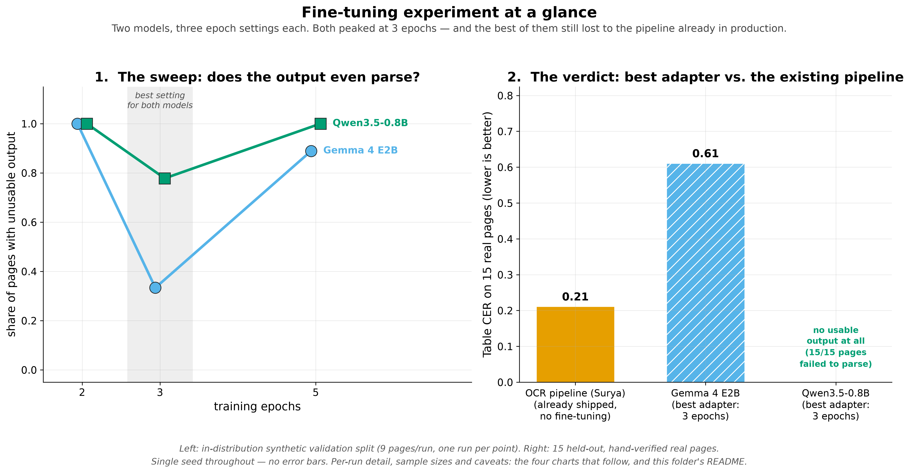
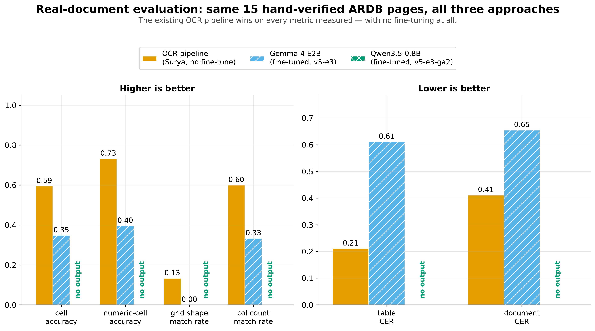
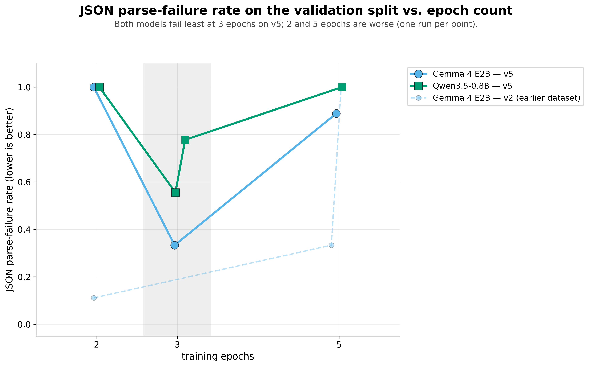
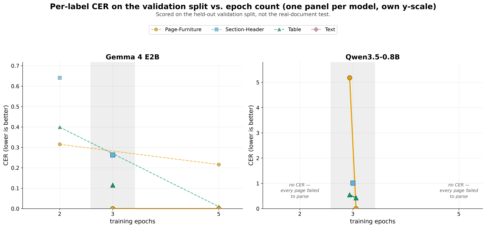
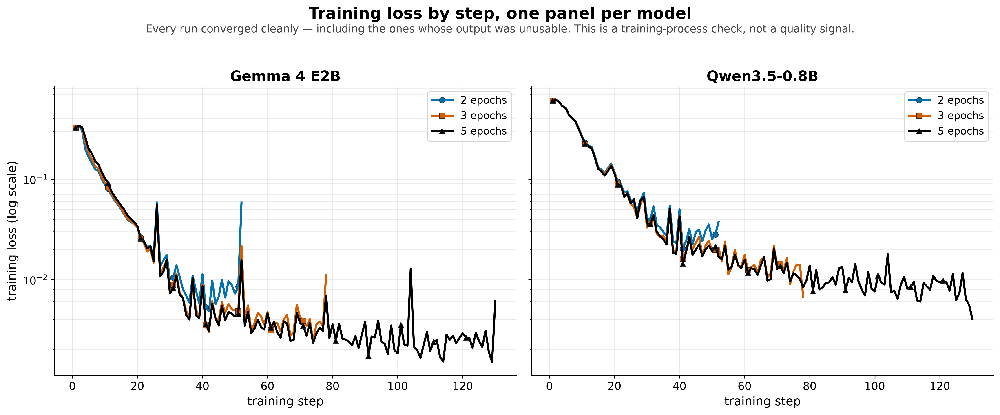

# Fine-tune evaluation charts

We tried fine-tuning two small AI models — **Gemma 4 E2B** and **Qwen3.5-0.8B** — to read ARDB
documents directly, and compared them to the OCR pipeline we already use (**Surya**, no
fine-tuning). These charts show what happened. The full numbers and write-up are in
`eval/gemma_finetune_runs.md` and `eval/qwen_finetune_runs.md` — these charts are the picture
version of that.

## The result, in plain terms

**Our existing OCR pipeline still wins, without any fine-tuning at all.** Neither fine-tuned
model beat it on real documents.

**3 epochs was the training length that worked best for both models.** An "epoch" is one full
pass through the training data. You might expect more training = better results, but that's not
what happened here: training for fewer epochs (2) *or* more epochs (5) made both models worse,
not better. 3 was the sweet spot for both models, independently.

**Training itself worked fine.** The models were learning normally the whole time (their
training loss went down smoothly). The problem isn't that training broke — it's that the models
don't reliably produce correct, readable output yet.

## Two kinds of file here

- **5 simple charts** (numbered 0–4 below) — these are what you'd put on a slide or in the
  report. Just the chart, a title, and the key point. No small print.
- **1 "dashboard" image** (`finetune_dashboard.png`) — one big sheet with every chart's full
  detail (exact sample sizes, run numbers, extra notes). Use this only if someone asks a very
  specific follow-up question, like "how many pages was that average based on?"

Both come from the exact same code and the exact same numbers — the dashboard just shows more
of the fine print. They can't disagree with each other.

(The 4 charts one folder up in `docs/report/figures/` — `accuracy_by_font.png`, `cer_by_dataset.png`,
etc. — are from separate, earlier OCR testing and aren't part of this fine-tuning story.)

---

## 0. `finetune_story_overview.png` — the whole experiment in one picture



**What it shows**: Two panels side by side.

- **Left**: as training length (epochs) goes up, what share of test pages came back as broken,
  unreadable output?
- **Right**: taking each model's best training length, how does it compare to our existing OCR
  pipeline on 15 real documents?

**How to read it**: Read left to right, like a story. On the left, both lines (Gemma = blue,
Qwen = green) dip down at 3 epochs (the gray band) — that's the best point — and go back up at
5. On the right, you can see that even the *best* version of each model still lost to the OCR
pipeline (orange bar). Qwen doesn't even show a bar — it produced nothing usable on all 15
pages.

**Takeaway**: this is the one chart that tells the whole story if you only have time for one.
Charts 1–4 below are the detailed evidence behind it.

*Note: to keep this one simple, it only shows one measurement per model (not all six ways we
measured accuracy). Charts 1–4 have the full numbers — if this chart and a detail chart ever
seem to disagree, trust the detail chart.*

---

## 1. `real_doc_comparison.png` — does either fine-tuned model actually work?



**What it shows**: our OCR pipeline vs. each model's best fine-tuned version, tested on the same
15 real documents (documents none of them were trained on). Left side: measurements where a
taller bar is better (accuracy). Right side: measurements where a shorter bar is better (error
rate). Qwen has no bars — all 15 of its pages came back broken, so there's nothing to measure,
which is why it says "no output" instead of showing a bar at zero.

**How to read it**: taller = better on the left, shorter = better on the right. The OCR pipeline
(orange) beats both models on every single measurement. One important detail: a bar that's
exactly `0.00` is a real score of zero — but "no output" means the model produced nothing at
all. Those are opposite things, especially on the error-rate side (where a real `0.00` would
actually mean a *perfect* score).

**Takeaway**: this is the headline result. On real documents, our existing pipeline wins across
the board, and Qwen can't produce usable output at all. Gemma does better than Qwen, but still
isn't good enough to replace the current pipeline.

---

## 2. `parse_failure_rate_by_run.png` — can the model even produce a readable answer?



**What it shows**: the model is supposed to answer in a structured format called JSON. Sometimes
it fails to do that — its output comes out broken or unreadable, before we even get to check if
the text itself is correct. This chart shows, for every training run, what share of pages came
back broken (1.0 = every page broke, 0.0 = none did).

**How to read it**: the bottom axis is training length in epochs (2, 3, or 5) — not the order
the runs happened in — so both models' results at the same training length line up directly
above each other. Blue = Gemma, green = Qwen. The gray band marks 3 epochs, where both models
did best.

There's also a faded, dashed light-blue line — that's Gemma tested on an older, smaller dataset
(`v2`) as a point of comparison. It's drawn lightly on purpose so it doesn't get confused with
the real comparison (the solid lines, both on the same `v5` dataset).

**Takeaway**: for both models, training for 3 epochs broke the fewest pages. Training shorter
(2) or longer (5) broke more pages, not fewer. That's true for both models, run independently of
each other — which is why we stopped exploring past 5 epochs.

---

## 3. `cer_by_run.png` — when it does work, how accurate is the text?



**What it shows**: "CER" stands for **Character Error Rate** — roughly, what share of the
letters/characters would need fixing to make the model's answer correct. Lower is better. This
chart shows CER for each type of content on the page (page headers, tables, section titles,
etc.), split into one panel per model.

**How to read it**: same bottom axis as chart 2 (training length in epochs), same gray band at
3 epochs. Each color is a different type of content on the page (see the legend). Note the two
panels use different scales — Qwen's worst point is much higher than anything in Gemma's panel,
so squeezing them onto one scale would make everything else too small to read.

One thing worth calling out: where you see **"no CER — every page failed to parse,"** that means
the model was tested at that training length, but every single page broke (see chart 2), so
there was no readable text left to check. That's different from "we didn't test it" — it *was*
tested, it just didn't produce anything usable.

**A caution**: some points on this chart are based on very few pages — as few as one. A score
based on one page isn't a reliable pattern, but it looks the same on this chart as a score based
on twelve pages. The `finetune_dashboard.png` sheet shows exactly how many pages back each point
— check there before treating any single point as a solid conclusion.

**Takeaway**: accuracy roughly follows the same pattern as chart 2, but the worse-performing
training runs also have less data behind them (since fewer pages parsed successfully), so their
numbers should be trusted less.

---

## 4. `loss_by_run.png` — did the training process itself work?



**What it shows**: "training loss" is a number that should go down steadily while a model is
learning — it's a basic health check on the training process, not a measure of how good the
model actually is. This chart shows that number over time, for every run, split into one panel
per model.

**How to read it**: a smoothly dropping line means training worked normally, with no errors. It
does **not** mean the model is good — one run had a perfectly smooth training curve and still
failed to produce a single usable page afterward. So use this chart alongside charts 2 and 3,
not instead of them. Colors here mean training length (2, 3, or 5 epochs) rather than model,
since each panel is already one model.

**Takeaway**: every run trained normally with no problems. So the issue isn't a broken training
setup — it's that the trained models don't yet produce reliable output.

---

## A few things worth knowing before using these numbers

- **Each result comes from a single run** — nothing here was repeated and averaged over
  multiple attempts (Colab's free GPU time was a real limit on this project). So treat
  differences between points as a likely direction, not a fully proven fact. The dashboard sheet
  shows exactly how much data (how many pages) is behind each point.
- **Colors are chosen so colorblind readers and black-and-white printouts can still tell lines
  apart** — every chart also uses different marker shapes, dashed vs. solid lines, or patterns
  (not color alone) to separate different series. This was checked by actually converting each
  chart to grayscale and looking at it, not just assumed.

## File formats

Every chart comes as both a `.png` (for pasting into a document or slide) and a `.pdf` (for
printing, or if the image needs to be resized without going blurry). Same content either way —
use whichever your tool handles better.

## Regenerating these charts

```bash
uv run python3 tools/plot_run_metrics.py eval/gemma_finetune_runs.csv eval/qwen_finetune_runs.csv --out-dir docs/report/figures/finetune_eval
uv run python3 tools/plot_real_doc_comparison.py eval/real_doc_eval.csv --out docs/report/figures/finetune_eval/real_doc_comparison.png
uv run python3 tools/plot_finetune_story.py eval/gemma_finetune_runs.csv eval/qwen_finetune_runs.csv --real-doc-csv eval/real_doc_eval.csv --out docs/report/figures/finetune_eval/finetune_story_overview.png
uv run python3 tools/plot_finetune_dashboard.py eval/gemma_finetune_runs.csv eval/qwen_finetune_runs.csv --real-doc-csv eval/real_doc_eval.csv --out docs/report/figures/finetune_eval/finetune_dashboard.png
```

Run all four commands together — the dashboard is built from the same code as the other three,
so if you only re-run some of them, the dashboard can go out of date. All four read straight
from the `eval/*.csv` files, so re-run them any time a new fine-tuning result gets logged.
